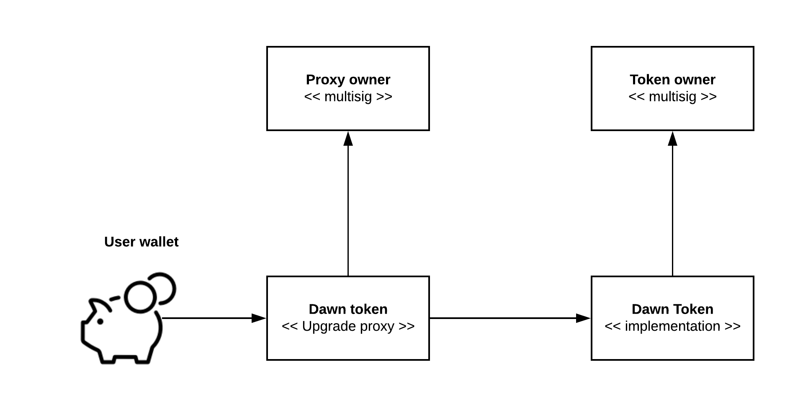
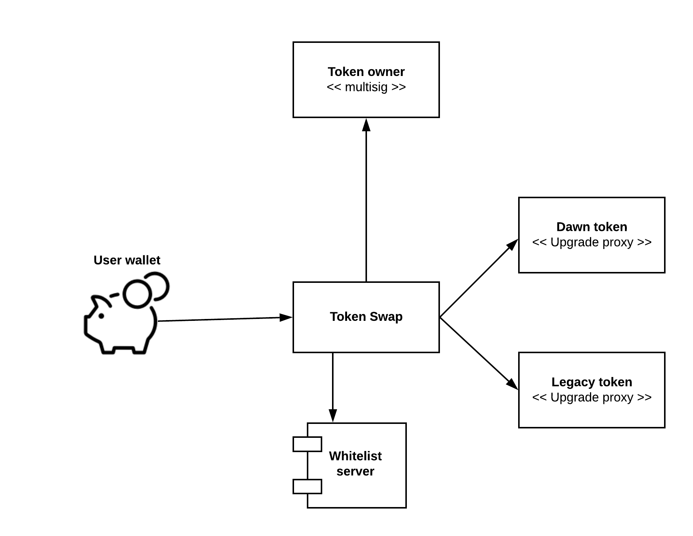
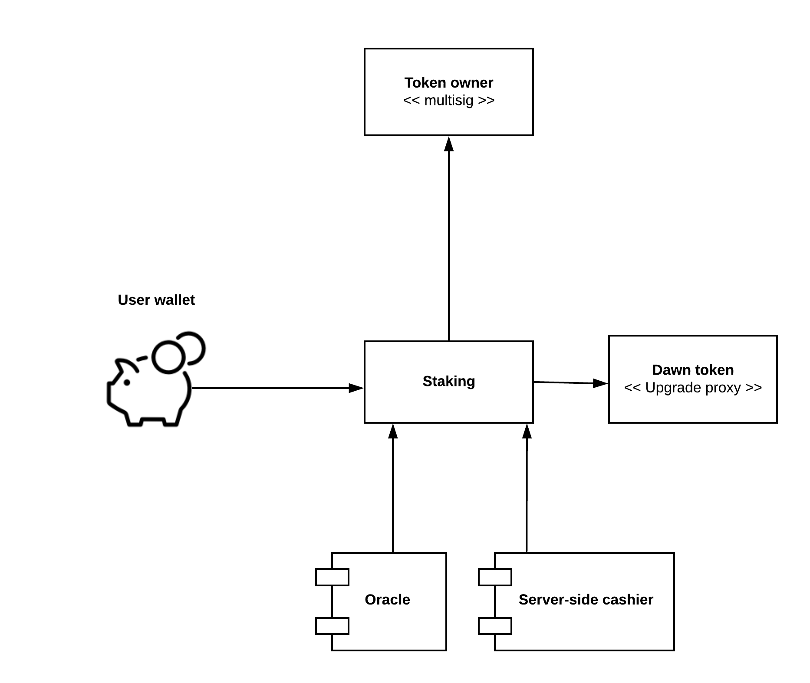

# Welcome to the New Begining


#### Dawn is a global, self-governed, and open-sourced protocol that empowers and rewards gamers.</br>

This is a Dawn ERC-20 token for [FirstBlood decentralised eSports platform](https://firstblood.io).


# Introduction

* Dawn token (DAWN) is a new token that is 1:1 swapped from the existing [FirstBlood 1ST token](https://github.com/Firstbloodio/token).

* Token swap requires an identity verification that is done on the server-side whitelisting,
  using a Solidity `ecrecover()` signing.

* DAWN can be used on FirstBlood platform and other services as a utility token: method of payment, staking, etc.

* Token complies with [EIP-20 standard](https://github.com/ethereum/EIPs/blob/master/EIPS/eip-20.md) (former ERC-20 candidate).
  The original 1ST token was created at the time when ERC-20 process was still about to start,
  so some implementation details are different.
  This makes it easier to use token in various decentralised finance services like decentralised exchanages (DEXes)
  and lending pools.

* Token complies with [EIP-777 standard](https://eips.ethereum.org/EIPS/eip-777) (former ERC-777 candidate).
  This standard defines a new way to interact with a token contract while remaining backward compatible with ERC20.

* Token smart contract supports [recovering tokens accidentally send into it](./contracts/Recoverable.sol).

* The token is upgradeable through [OpenZeppelin proxy pattern](https://docs.openzeppelin.com/learn/upgrading-smart-contracts)
  ([actual contracts](https://github.com/OpenZeppelin/openzeppelin-sdk/tree/master/packages/lib/contracts/upgradeability)).

* The token implements a pause functionality that will be activated if and when the tokens are migrated to a new network.
  This is implemented using [OpenZeppelin pausable trait](https://github.com/OpenZeppelin/openzeppelin-contracts/blob/master/contracts/token/ERC20/ERC20Pausable.sol).
  This is similar what EOS did with their genesis block. Furthermore, the pause can be activated
  in the case there is a large exchange hack and a large token supply is lost,
  so that other exchanges have time to update their blacklists.

* EIP-777 standard supports burning of tokens to allow new utility models in the future.

* EIP-777 standard allows better token UX when integrating with decentralised finance smart contracts like
  lending pools.

# Software required

* solc 0.5.16 (0.5.16+commit.9c3226ce.Emscripten.clang)

* Node 0.12

* openzeppelin-solidity 2.5.0

* [npx](https://www.npmjs.com/package/npx)

# Overview

Below is a narrative introduction to the Dawn token and related smart contracts.

# Base packages

All contracts are based on base contracts from [OpenZeppelin SDK](https://github.com/OpenZeppelin/openzeppelin-sdk) package.
This package differs from more well known [openzeppelin-solidity](https://github.com/OpenZeppelin/openzeppelin-sdk)
package, as all contracts use `Initializer` pattern instead of `constructor` pattern to set up the contracts.
This is done to support Upgrade Proxies that do not work with direct constructors.

Although, currently only Dawn ERC-20 token contracts is upgradeable, we do not want to mix contracts
with the same name from two different packages, so all contracts are done using OpenZeppelin SDK flavour.

## Token

The token is based on [OpenZeppelin upgradeable ERC-20 contract].

### Token deployment



The upgrade proxy contract is the actual "published" token contract.

* Upgrade proxy will be controlled by its own multisig, as `owner()` of token cannot be shared between
  proxy and the actual implementation

* Token owner multisig can pause the token - an action that might later required in a chain migration

* Token supports the following traits: Burnable, Pausable, Recoverable

## Token swap

The token swap contract is written from the scratch for this swap.

### Token swap deployment



* The new token supply is held in the owner multisig and approve()'ed for the token swap

* The users will `approve()` their old tokens for the swap and then perform a `swap()` transaction

* Each `swap()` transaction requires a server-side calculation of v, r, and s. We use this
  with `ecrecover()` to check that the address performing the swap was whitelisted by our server.

* Token swap contract has `Recoverable` trait to help users with the issues of missending wrong tokens
  on the contract

* Token swap contract has a `burn()` with a destination, where the old tokens can
  be send to die by the swap owner.
  The legacy 1ST token does not have a burn trait, so these tokens are simply
  send to the zero address.

## Staking

A staking contract allows users to lock up a predefined amount of tokens for a predefined time.
This is the simplest form of staking, allowing FirstBlood and other eSports actors
to take the first steps towards a more decentralized ecosystem over time.

Staking happens by doing ERC-777 send() in to the staking contract.
The send amount, or price, is predefined, but can be adjusted over a
time by an oracle. Likewise, the lock period is predefined but
can be adjusted.

To unstake, the user must manually call `unstake()` for their
previous stake id.

## Flash staking

The staking contract also supports "flash staking",
so that tokens are bought and staked in a single transaction,
instead of the user need to go through manual steps
to set everything accept.

* There could be a smart contract that accepts ETH payments

* The smart contract buys DAWN token with this ETH
  from a liquidity pool like Uniswap

* Bought tokens are staked on the behalf of the user by the smart contract

* Extra tokens are send back to the wallet that paid
  ETH for buying in the first place

To stake on the behalf of someone else,
you need to fill `userData` of ERC-777 `send()`
with correct parameters. This message will be decoded
by ERC777TokensRecipient callback.

### Staking deployment



* Staking contract is in-house, written from the scratch.

* Users can stake their tokens. Each stake needs the exact amount of tokens defined by the staking contract.
  The user must assign a stake id for their staking, and the stake is referred by this id in the events
  and unstaking.

* Later, after the stake period is expired, the user can `unstake()` their tokens using the given id.

* User can run multiple stakes a the same time, though there is no real use case for this.

* Staking contract has `Recoverable` trait to help users with the issues of missending wrong tokens
  on the contract.

* There is a special account, `stakingOracle`, that can set the stake amount and period.
  This gives flexibility e.g. to automate staking amount to follow a predefined US dollar
  price in the future.

## Recoverable

Recoverable is a mix-in contract that allows the owner to reclaim any
ERC-20 tokens send on the contract.

## TokenFaucet

The token faucet contract is a simple test token give away contract.
Its intend is to give people tokens in the (Görli) testnet, so they can
interact with the token swap on the beta website.

# Testing

You need to generate ABI files in `build/`

```sh
npx truffle compile
```

Then you can run tests with Jest:

```sh
npx jest
```

## Running a single text

Example:

```sh
npx jest -t 'Proxy should have an admin right'
```

## Running a single test module

Example:

```sh
npx jest --testPathPattern "tokenswap.ts"
```

## Debugging tests in Visual Studio Code

### Automatically attaching to a terminal command

Use `CMD + F1` and turn on Debugger Auto Attach in command palette.

Then you can run individual tests and VSCode will attach

```typescript
node --inspect-brk node_modules/.bin/jest --runInBand -t 'The supply should match original token'
```

### Using Launch config

launch.json example:

```json
// https://github.com/microsoft/vscode-recipes/tree/master/debugging-jest-tests
{
    "version": "0.2.0",
    "configurations": [
        {
            "type": "node",
            "request": "launch",
            "name": "Jest All",
            "program": "${workspaceFolder}/node_modules/.bin/jest",
            "args": [
                "--runInBand",
                "--config",
                "./test/jest-e2e.json"
            ],
            "console": "integratedTerminal",
            "internalConsoleOptions": "neverOpen",
            "disableOptimisticBPs": true,
            "windows": {
                "program": "${workspaceFolder}/node_modules/jest/bin/jest",
            },
            "env": {
                "PATH": "/Users/moo/.nvm/versions/node/v11.0.0/bin:${env:PATH}"
            },
        },
    ]
}
```

# Conformance suite

In [conformance folder](./conformance) we have direclty lifted
[OpenZeppelin ERC-777 test suite](https://github.com/OpenZeppelin/openzeppelin-contracts-ethereum-package/blob/master/test/token/ERC777/ERC777.test.js).
These Truffle tests will test against our proxy token to see that the token does what

Because tests are Truffle, Chai and Mocha, they do not run under our normal test runner.
Porting 172 tests for Jest would be little bit too much work.
Thus, the tests are put to a separate folder.
You can run them with Truffle by:

```sh
truffle test conformance/ERC777.js
```

# Linting

Follow [AirBNB TypeScript Coding Conventions](https://www.npmjs.com/package/eslint-config-airbnb-typescript)

## Visual Studio Code

[Install ESLint Plugin](https://marketplace.visualstudio.com/items?itemName=dbaeumer.vscode-eslint)

Add to your workspace settings.json

```json
    "editor.codeActionsOnSave": {
        "source.fixAll": true
    }

    "prettier.eslintIntegration": true
```

## Prettier

[Install Prettier](https://marketplace.visualstudio.com/items?itemName=esbenp.prettier-vscode).

Add in Visual Studio Code Settings JSON

```json
  "[typescript]": {
    "editor.defaultFormatter": "esbenp.prettier-vscode",
    "editor.formatOnSave": false
  }
```

You can manually format the source code with `CMD + F1` and choosing `Format document`.

[See also this blog post](https://levelup.gitconnected.com/setting-up-eslint-with-prettier-typescript-and-visual-studio-code-d113bbec9857)

## Command line

Run `eslint` by hand:

```bash
npx eslint --ext .ts tests/ src/
```

# Deploying

## Testnet

This will deploy a mock of old token, a mock of new token, a token swap and
a testnet token faucet contracts.

1. Generate two new private keys, one for the deployment account and one for the server-side signer

```sh
openssl rand -hex 32
```

2. [Create account on Infura and get API key for goearly]().

3. Create a config file `secrets/goearly.env.ini`. For variable documentation see [deployTestnet.js](src/scripts/deployTestnet.js).

```ini
deployerPrivateKeyHex = "..."

signerPrivateKeyHex = "..."

oraclePrivateKeyHex = "..."

tokenOwnerPrivateKeyHex = "..."

infuraProjectId = "..."


```

4. Get the address for the deployment account by running the deployer without ETH

```sh
npx ts-node src/scripts/deployTestnet.ts
```

5. [Visit faucet to get testnet eth on the deployment account](https://goerli-faucet.slock.it/)

6. Deploy now with having some gas money

```sh
npx ts-node src/scripts/deployTestnet.ts
```
# Testnet deployment

## Ropsten

The contracts are currently deployed on Ropsten testnet:

```
Legacy token {
  address: '0x6a5d2F16E9D2113d568064AEec93Fbd6c195Ca39',
  name: 'Mock of old token',
  symbol: 'OLD',
  supply: '93468683899196345527500000'
}
Upgrade proxy for new token {
  address: '0xAE60F66d9FDf4ccb172D1c672466e1AdB6b67985',
  admin: '0xbe48960593b6468AF98474996656D2925E1825df',
  implementation: '0x44087611394B3ab2DB733A065049f7B5ebf8E1f9'
}
New token through upgrade proxy {
  name: 'Mock of new token',
  address: '0xAE60F66d9FDf4ccb172D1c672466e1AdB6b67985',
  symbol: 'NEW',
  supply: '93468683899196345527500000'
}
Token swap {
  address: '0xF8AdFe0E6cE1537841b39d23b6C0d9cF97210dD3',
  tokensLeftToSwap: '5000000000000000000000',
  signerKey: '39cc67e7dbf2c162095bfc058f4b7ba2f9aa7ec006f9e28dc438c07662a3bb41'
}
Faucet {
  address: '0x513C674d8ba4358319D6f6E50330A73670EE978f',
  faucetAmount: '3000000000000000000',
  balance: '5000000000000000000000'
}
Staking {
  address: '0x1a39637F17CcAdbD7d2663cE6eb4Ad5977fAC2c6',
  token: '0xAE60F66d9FDf4ccb172D1c672466e1AdB6b67985',
  stakingTime: '86400',
  stakingAmount: '2500000000000000000',
  oracle: '0x1FCE2cf3D1a1BC980f85FEf6bF3EE17DD6eBcC8D'
}
```

## Goerli

Here is a sample deployment in Goerli testnet:

```
Legacy token {
  address: '0x50C1670Ea610264c328B072C34A268C9756018eE',
  name: 'Mock of old token',
  symbol: 'OLD',
  supply: '93468683899196345527500000'
}
Upgrade proxy for new token {
  address: '0x8d4Edf8bD61405fd64332882E1e96E4eac729B5C',
  admin: '0xbe48960593b6468AF98474996656D2925E1825df',
  implementation: '0x47079f4A16625f6d2c645f99A5d0bF669873e8a7'
}
New token through upgrade proxy {
  name: 'Mock of new token',
  address: '0x8d4Edf8bD61405fd64332882E1e96E4eac729B5C',
  symbol: 'NEW',
  supply: '93468683899196345527500000'
}
Token swap {
  address: '0x0AFeB3a850CF3672388522BC7c3E55a4De2F2902',
  tokensLeftToSwap: '5000000000000000000000',
  signerKey: '39cc67e7dbf2c162095bfc058f4b7ba2f9aa7ec006f9e28dc438c07662a3bb41'
}
Faucet {
  address: '0xF5C2FE0DaF9a6123D12FB3eC5dA0A4E651b6BAd7',
  faucetAmount: '3000000000000000000',
  balance: '5000000000000000000000'
}
Staking {
  address: '0x1570495a27D55De6196dD0EE856167347B621fbE',
  token: '0x8d4Edf8bD61405fd64332882E1e96E4eac729B5C',
  stakingTime: '86400',
  stakingAmount: '2500000000000000000',
  oracle: '0x1FCE2cf3D1a1BC980f85FEf6bF3EE17DD6eBcC8D'
}Update
```

# Production deployment strategy

Two different multi-signature wallets are needed.

* Token owner who is responsible for admin functions for the token contract itself like `pause()` from `ERC20Pausable`

* Proxy owner who is responsible for calling `upgradeTo()` if a contract upgrade is needed

* [Due to the fact how Proxy contract works, these two addresses cannot be the same wallet](https://docs.openzeppelin.com/upgrades/2.7/proxies#transparent-proxies-and-function-clashes)

# Slither

Slither automated security audits.

Install

```sh
python3 -m venv venv
source venv/bin/active
pip install slither-analyzer
```

Running

```
export SOLC_VERSION=0.5.16
slither --solc ./dockerized-solc.sh .
```

# Audits

* [The latest audit report for OpenZeppelin SDK contracts](https://medium.com/nomic-labs-blog/zeppelinos-smart-contracts-audit-iv-a52987973b88)

* [OpenZeppelin UpgradeProxy in other well-known projects and audits](https://forum.openzeppelin.com/t/openzeppelin-usage-in-audited-well-known-projects/2556/8?u=miohtama)

# Other

* [ERC-777 example](https://forum.openzeppelin.com/t/simple-erc777-token-example/746)

* [ERC-777 narrative explanation](https://medium.com/coinmonks/erc-777-a-new-advanced-token-standard-c841788ab3cb)

* [More about OpenZeppelin smart contract upgrade pattern](https://docs.openzeppelin.com/upgrades/2.7/)

* [Truffle and TypeChain example](https://github.com/ethereum-ts/truffle-typechain-example) (a legacy reference - was a lot of pain and both Truffle and TypeChain have now been removed)
